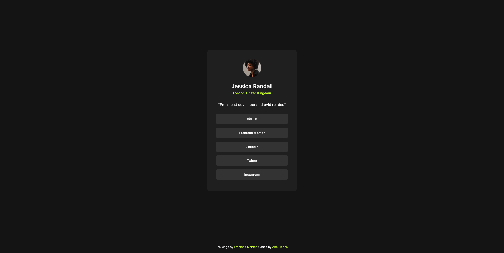

# Frontend Mentor - Social links profile solution

This is a solution to the [Social links profile challenge on Frontend Mentor](https://www.frontendmentor.io/challenges/social-links-profile-UG32l9m6dQ). Frontend Mentor challenges help you improve your coding skills by building realistic projects. 

## Table of contents

- [Overview](#overview)
  - [The challenge](#the-challenge)
  - [Solution](#solution)
  - [My attempt](#my-attempt)
- [My process](#my-process)
  - [Built with](#built-with)
  - [What I learned](#what-i-learned)
  - [Continued development](#continued-development)
- [Author](#author)


## Overview

### The challenge

Users should be able to:

- See hover and focus states for all interactive elements on the page

### Solution


### My attempt


I think the sizing is a little bit off.

## My process

I had a top down approach, meaning I started on the main elements such as the background and container, centered them, applied styles, and then added the elements. Is this effecient and optimal? I have no idea, this is my first time doing something like this.

### Built with

- Pure HTML
- Pure CSS

### What I learned

```html
<!-- My very ugly method of creating a list of links -->
<div class="profile-links">
  <a href="#" class="link-container">
    <div>GitHub</div>
  </a>
  <a href="#" class="link-container">
    <div>Frontend Mentor</div>
  </a>
  <a href="#" class="link-container">
    <div>LinkedIn</div>
  </a>
  <a href="#" class="link-container">
    <div>Twitter</div>
  </a>
  <a href="#" class="link-container">
    <div>Instagram</div>
  </a>
</div>
```
```css
/* Link hover effect */
.link-container:hover {
    background-color: var(--accent-color);
    color: var(--grey-900);
}
```

## Continued development

I plan to better make use of relative units to make my website more responsive. I also plan to expirement with Tailwind CSS.

## Author

- My neocities website (work in progress) - https://abeblanco.neocities.org
- Frontend Mentor - [@ceabe](https://www.frontendmentor.io/profile/ceabe)